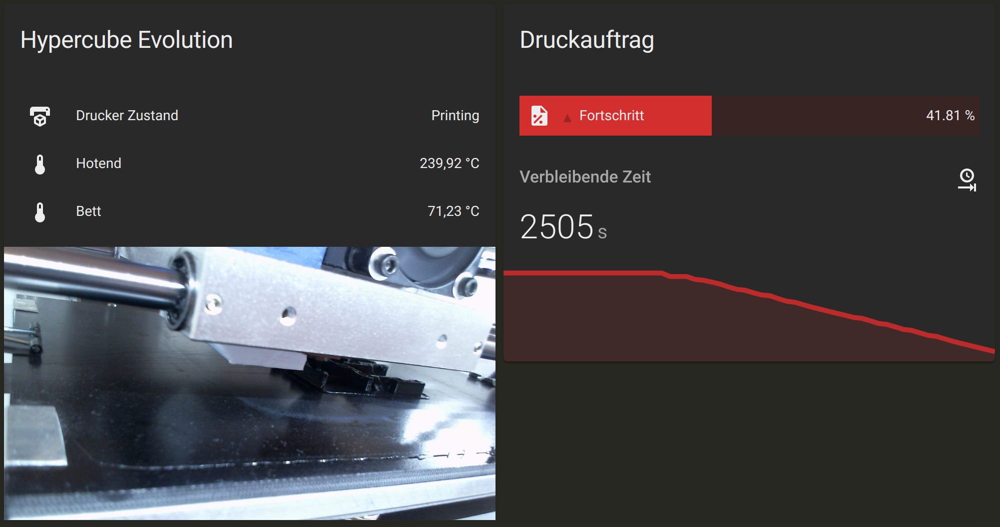

:css: style.css

.. title:: Octoprint Integration

----

:data-x: r2400

.. image:: images/octoprint.png
   :width: 300px

Octoprint Integration
=====================

Der Druckserver im Home Assistant

Markus Pöschl

----

.. image:: images/tldr.jpg

Agenda
------

* Was ist Octoprint?
* Was kann die Integration in Home Assistant?

----

Octoprint
---------

* Druckserver zur Steuerung von 3D Druckern via USB
* Linux/Windows/Mac
* entwickelt seit 2012 von Gina Häußge
* Gratis Sofware mit Donation

https://octoprint.org/

----

.. image:: images/tldr.jpg

Octoprint Standardfunktionen
----------------------------

* Weboberfläche
* GCode an Drucker übertragen
* Monitoring und Steuerung beliebiger Drucker (Laser/CNC)
* Webcam zur Überprüfung
* Zeitrafferaufnahmen

TBD: Oberfläche Octoprint Bild

----

Home Assistant Konfiguration (yaml)
-----------------------------------

* Bisher nur über Yaml konfigurierbar

.. code-block:: yaml

  octoprint:
    host: '!secret octopi_host'
    api_key: '!secret octoprint_api_key'
    name: Hypercube Evolution
    bed: true
    number_of_tools: 1
    sensors:
      monitored_conditions:
        - 'Current State'
        - 'Job Percentage'
        - 'Time Remaining'
        - 'Temperatures'

  camera:
    - platform: mjpeg
      name: Hypercube Evolution Cam
      still_image_url: !secret octoprint_snapshot_url
      mjpeg_url: !secret octoprint_webcam_url

----

Home Assistant Integration
--------------------------

* Monitoring von Temperaturen
* Monitoring Druckerzustand
* Druckfortschritt

TBD: Bild mit aktivierter Oberfläche

----

Ausblick
--------

* UI Konfiguration
* Integration erneuern
* Drucker auch steuern
